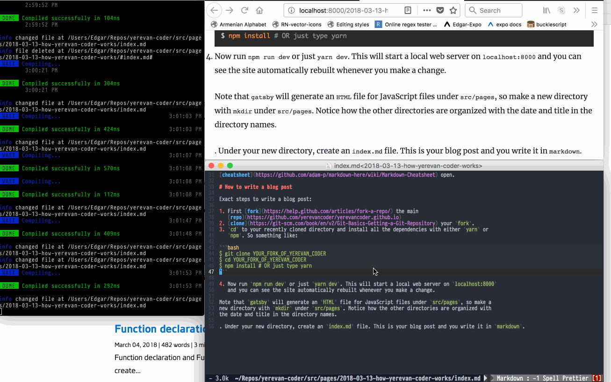

# web application

`yerevancoder`, (yc), is a [gatsby](https://www.gatsbyjs.org/) web application and its built using a
very important JavaScript library called [react](https://reactjs.org/). The site is a hybrid app
because some of the site is generated on the server side (the blog posts) and some parts (the hiring
board) are dynamic and made on the client with `JavaScript`. Gatsby is also a 'serverless' application
because we use [firebase](https://firebase.google.com/) to provide for things like user
authentication and a database, (because our traffic is low we don't pay firebase for the
service). This means that we can build everything for our application with just JavaScript and we
don't have to run a server. Because the site is a github pages site, we don't pay for hosting (the
computers that physically provide the `HTML` and `JavaScript`). Serverless `JavaScript` applications
are very popular now because you can build an entire startup just by writing `JavaScript`.

`GitHub` gives us a free domain at `http://yerevancoder.github.io` but you'll notice that the site
is `https://yerevancoder.com`. So we have a custom domain name, this is done by having a `CNAME`
file at `public/CNAME`. However that doesn't provide us with
[https](https://en.wikipedia.org/wiki/HTTPS), so for that part we use
[cloudflare](https://www.cloudflare.com/) which provides us with free
[DDoS](https://en.wikipedia.org/wiki/Denial-of-service_attack) protection and `https`.

## The blog posts

Blog posts are easy to write and require knowledge of only two things, [git](https://git-scm.com/)
and [markdown](https://en.wikipedia.org/wiki/Markdown). To learn `git`, you need practice and we use
it so that we can save the blog posts to the github repo and make pull requests (a request for
someone to accept your work into a master copy of the source code). I recommend looking at this
interactive website for learning [git](https://learngitbranching.js.org/) and our own blog
[post](https://yerevancoder.com/2018-02-18-git-and-github/). For markdown, look at the source code
of other blog posts and keep this
[cheatsheet](https://github.com/adam-p/markdown-here/wiki/Markdown-Cheatsheet) open.

## How to write a blog post

Exact steps to write a blog post:

1. First [fork](https://help.github.com/articles/fork-a-repo/) the main
   [repo](https://github.com/yerevancoder/yerevancoder.github.io)
2. [clone](https://git-scm.com/book/en/v2/Git-Basics-Getting-a-Git-Repository) your `fork`.
3. `cd` to your recently cloned directory and install all the dependencies with either `yarn` or
   `npm`. So something like:

```bash
$ git clone YOUR_FORK_OF_YEREVAN_CODER
$ cd YOUR_FORK_OF_YEREVAN_CODER
$ npm install # OR just type yarn
```

4. Now run `npm run dev` or just `yarn dev`. This will start a local web server on `localhost:8000`
   and you can see the site automatically rebuilt whenever you make a change, it lets you iterate
   very fast, the automatic refresh is called
   [hot-module-replacement](https://webpack.js.org/concepts/hot-module-replacement/) and gatsby sets
   it up for us.



Note that `gatsby` will generate an `HTML` file for JavaScript files under `src/pages`, so make a
new directory with `mkdir` under `src/pages`. Notice how the other directories are organized with
the date and title in the directory names.

5. Under your new directory, create an `index.md` file. This is your blog post and you write it in
   `markdown`, be sure to make sure that the top part of the markdown file is set up correctly,


6. Once you are happy with the post, create a [pull
   request](https://help.github.com/articles/about-pull-requests/) and someone with commit access
   for the main yerevancoder repo will either merge the PR or will give some comments.

This is basically the flow of all open source projects so its important to get some experience in
it, the dynamic part which is the React coding part, will be explained in part two.
